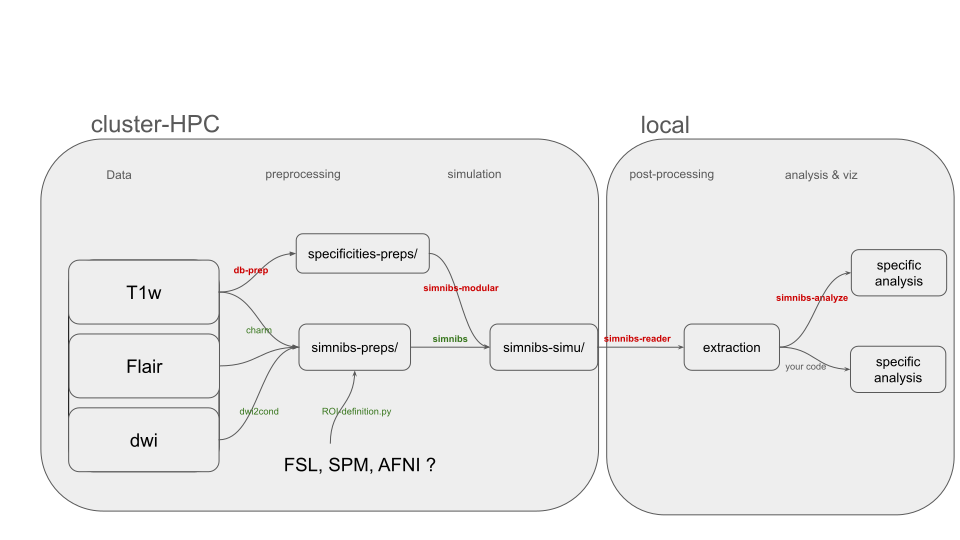

---
hide:
  - navigation
---
# simnibs-reader

**Load, extract, clean and analyze SimNIBS e-field NIfTI outputs — in one line.**

`simnibs-reader` is a lightweight Python library that turns SimNIBS simulation
results into analysis-ready ROI data with built-in outlier removal, smoothing,
statistics and export.

---

## Installation

```bash
pip install simnibs-reader
```


---

## Quick Example

```python
from simnibs_reader import SimNIBSResults

results = SimNIBSResults("/path/to/simnibs/output")
efield = results.efield()

# Extract ROI, clean, get stats — 3 lines
roi = efield.get_roi(mask="my_roi.nii.gz")
cleaned = roi.postprocess(smooth_fwhm=2.0, outlier_method="iqr")
cleaned.stats()
# {'mean': 0.142, 'median': 0.138, 'std': 0.031, 'max': 0.241, ...}
```

---


## Ecosystem

<div class="grid cards" markdown>

-   :fontawesome-solid-brain:{ .lg .middle } **SimNIBS**

    ---

    The core simulation platform for non-invasive brain stimulation.

    [:octicons-arrow-right-24: Documentation ](https://simnibs.github.io/simnibs/build/html/index.html)

-   :material-package-variant:{ .lg .middle } **simnibs-modular**

    ---

    Modular pipeline components for SimNIBS workflows.

    [:octicons-arrow-right-24: GitHub Pages](https://ICM-Frontlab-CDPR.github.io/simnibs-modular/)
    · [:octicons-mark-github-16: Repo](https://github.com/ICM-Frontlab-CDPR/simnibs-modular)

-   :material-chart-bar:{ .lg .middle } **simnibs-analyze**

    ---

    Statistical analysis tools for SimNIBS outputs.

    [:octicons-arrow-right-24: GitHub Pages](https://ICM-Frontlab-CDPR.github.io/simnibs-analyze/)
    · [:octicons-mark-github-16: Repo](https://github.com/ICM-Frontlab-CDPR/simnibs-analyze)

</div>
<!-- ``` -->


---

## ⚡️ Automated Stroke Pipeline

{ width="100%" }

*End-to-end automated pipeline for stroke lesion-aware tDCS simulation and analysis.*
